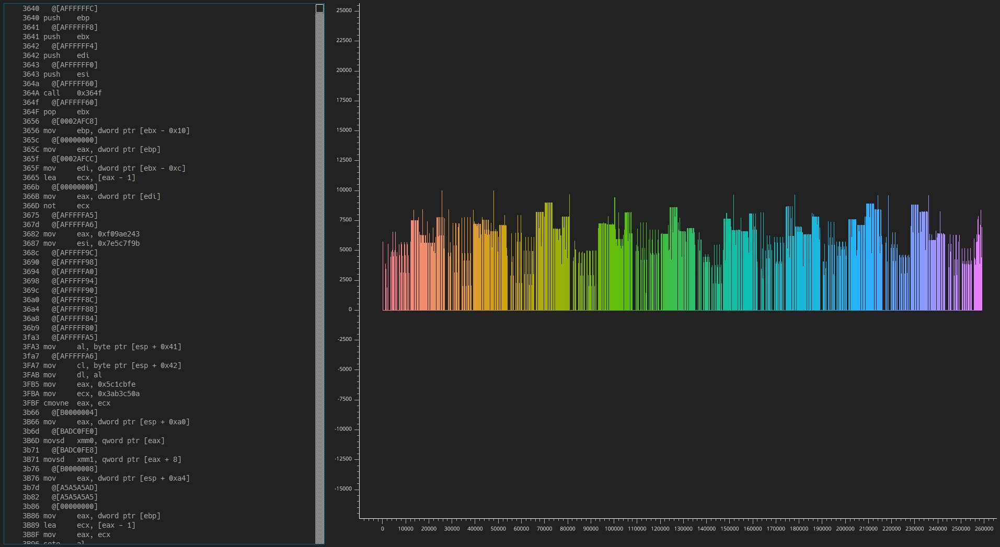

# Rainbow 

It makes unicorn traces.

Using [Unicorn](http://www.unicorn-engine.org/) as a basis, Rainbow aims to provide an easy scripting interface to loosely emulate embedded binaries, trace them to perform side-channels, and (sometime in the near future :) )simulate fault injections.

This is to allow quick and easy testing of physical attack resistance of code snippets, in order to help developers have a first evaluation of the resistance of their code.

## Installation

- `setup.py install`

If Unicorn or Capstone fails to install somehow :
- Unicorn : http://www.unicorn-engine.org/download/
- Capstone : https://www.capstone-engine.org/

For the side-channel examples, you need to grab the latest [Lascar](https://github.com/Ledger-Donjon/lascar)

## Running the examples

Some examples will use Lascar's side-channel attacks and try to display traces using a custom plotter built on top of [Vispy](https://github.com/vispy/vispy). If you want to run those, you will need Vispy and `pyqt5` for the instruction trace + execution trace viewer.

## Example output

See the `x64_pimp_my_xor` example for a debug trace.

In the comment part of each line (after the semicolon), the memory access that was performed is written in a simplified way : `[address] <- value` for a load or `value -> [address]` for a store. Right after, if any register was modified during this instruction, its new value is shown.

At a branch instruction, if the destination is a known function, its name is shown together with the return address and the function's address.

## Basic usage

Grab a device or generic emulator like so

```python
from rainbow.devices import rainbow_stm32f215
from rainbow.generics import rainbow_x86

e = rainbow_(sca_mode=False)
```

Loading a binary

```python
e.load('file', typ='.elf')
```

File type is guessed on the extension when possible (.elf, .hex).

Starting the emulation is done like so:

```python
e.start(start_address, stop_address, count=number_of_instructions)
```

Just like with unicorn. The underlying Unicorn instance is always available as `e.emu`.

## Side-Channel simulation

Rainbow only produces an execution trace, without applying any processing (such as using the Hamming weight of all values and adding noise) on the values. This is left as some post-processing, so that the user can apply its own leakage model and simulate various conditions from the same traces. 
Also, not introducing any noise allows testing in a worst-case scenario, which can yield important results.  

To perform the analysis, one can use [Lascar](https://github.com/Ledger-Donjon/lascar). You can find some scripts in the `examples` folder here which already use it.

## Application examples

In the case of hardware wallets for example, one could check that :
- The PIN verification procedure does not allow to use a bad password even with a controlled instruction skip
- The scalar multiplication procedure does not leak any information on the used scalar
- a purely software AES is protected against basic DPA attacks
without using lab testing equipment (oscilloscope, current/EM probes, ...)

Rainbow and Lascar allow testing implemented countermeasures were correctly coded and the compiler did not interfere. It cannot, however, verify against hardware-related leaks such as some sequence of operations that somehow cancels out random masks on a bus or hidden register.

## Bonus applications

Whiteboxed encryption primitives could also be broken using this tool, instead of e.g. Intel Pin or Valgrind to trace execution. Unicorn has several advantages in this regard :

- Can be used on a different platform than that of the target binary
- Allows easy manipulation of the state (for example redefining an external call to `rand()` in python)

Disadvantages :  

- Some reverse engineering necessary !

As a whitebox example (available in `examples/OAES`, below is the result of the variance of [SECCON 2016's OAES](https://github.com/SECCON/SECCON2016_online_CTF/tree/master/Binary/500_Obfuscated%20AES) encryption function, which has a heavy control flow obfuscation. 
One can clearly see the 10 rounds of the AES despite this obfuscation :




## Supported archs

Embedded devices :
- STM32F215

Generic emulators :   
- ARM
- ARM Cortex M
- x86
- x86_64

File formats :
- ELF
- Intel Hex file

Planned :
- PE support
